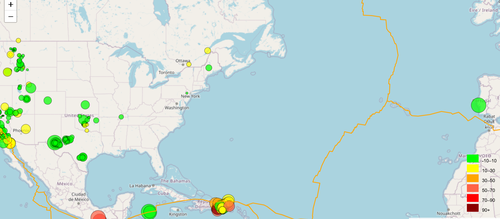

## Earthquake Map ##
This Challenge require us a interactive Earthquake map .It visualize the real time data from USGS 

I created repository with leaflet-Challenge name on github and clone this rep on my computer

# The purpose of this challenge #
  -- create earthquake visualization
  -- Use markers to reflect the magnitude of the earthquake by their size and the depth of the earthquake by color.
  -- Include popups that provide additional information about the earthquake.
  -- include legends to indicate depth intervals
# Technologies used #  
  -- Leaflet.js
  -- D3.js
  -- GEOJson
  -- Jscript
  -- HTML and CSS

For earthquake visualization, I used pseudocode to structure my code.
For dataset: The USGS provides earthquake data in a number of different formats,
I visited the given link to get the dataset.

# Code overview #
1. Create the 'basemap' tile layer using OpenStreetMap 
2. Create the 'street' tile layer as a second background of the map
3. Set the map with zoom and center option
4. Create the layer groups, basemaps, and overlays for our two sets of data, earthquakes and tectonic_plates.
5. Getting data using "https://earthquake.usgs.gov/earthquakes/feed/v1.0/summary/all_week.geojson" 
6. Display on the map using different function
7. Add legends
8. Add legends to map
9. In final step use geoJSON to get our Tectonic Plate and then add this layer to map

I am attaching the snip of my visual here

